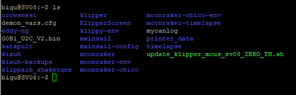
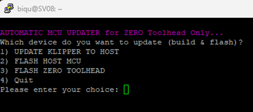
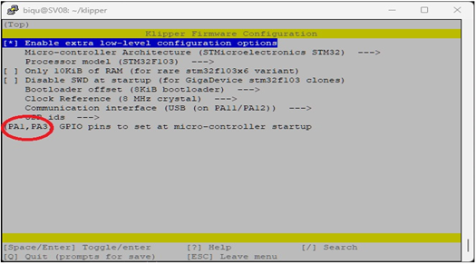
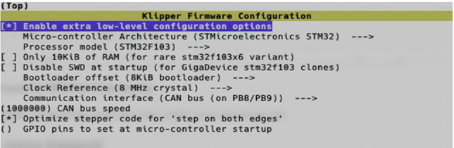
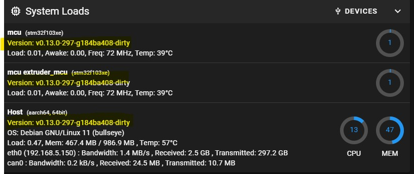

# This guide is for those that are running the Sovol Zero Toolhead on the Sovol SV08 <span style="color: red;">ONLY!!</span> 

## Overview
This guide walks you through on how to set up and use a modified version of ***Rappetor's Mainline MCU Update script.***  

This script has been tested by myself and a few others and it works well.

The revised script will give you these options.

1. **UPDATE KLIPPER TO HOST**
2. **FLASH HOST MCU**
3. **FLASH TOOLHEAD**
4. **QUIT**

This script gives you a simple and easy way to update klipper on all your devices, if you choose to do so.

---

## Dependencies
For this script to work it assumes [Katapult](https://github.com/Arksine/katapult) is flashed on the Host MCU because this script uses Katapult to flash the (newest) Klipper firmware onto the MCU's.

The ZERO Toolhead comes with Katapult already installed so do not try to reinstall it.

Read [Step 7 - Flash Katapult Bootloader]( https://github.com/Rappetor/Sovol-SV08-Mainline?tab=readme-ov-file#step-7---flash-katapult-bootloader) of Rappetor's Mainline Guide guide on how to get Katapult on the SV08 Host MCU.

___
## Steps to follow

1) Downloadd the script file from the repository above and place it in your biqu directory.

2) You will need to edit this file to change the HOST MCU serial number and toolhead UUID to match yours. 
    * Use WinSCP or a ftp file editor of your choice.
    * Note that it requires both the Stock UUID and the Actual UUID.
        * Stock UUID = The Default UUID 61755fe321ac that apears when the toolhead is in boot mode.
        * Actual UUID = The Canbus_UUID you entered into printer.cfg.
    * Also, if you are not running EDDY NG then comment out the lines that are identified as for EDDY NG in the "flash toolhead ()" section.
    * If you are running EDDY NG then leave them uncommented.
    * Using WinSP save the file to the BIQU directory.

3)  SSH into your printer to the BIQU directory.

4) Enter the command ls to confirm the file is there.  It should look like this in green.


```bash
ls
```



5) If it appears in white run this command

```bash
cd
sudo chmod 777 ./update_klipper_mcus_sv08_ZERO_TH.sh
```

Run ls again to confirm it turned green and is now executable.

```bash
cd
ls
```

6) Run the MCU Update script as shown below.

```bash
cd 
./update_klipper_mcus_sv08_ZERO_TH.sh
```

7) You will see this menu come up.  Very similar to Rappetor's original SV08 MCU Updater.



8) Select 1 to update Klipper first then follow in the numerical order.
    * Klipper will stop and then update.
    * If you run Eddy NG it will uninstall EDDY NG, Update Klipper and Reinstall EDDY NG.
        * If you run Shake & Tune you can re-install it with this command.
```bash
cd
wget -O - https://raw.githubusercontent.com/Frix-x/klippain-shaketune/main/install.sh | bash
```
___
___

9) The Host MCU Klipper configuration should look like this.

    *If you have a different main board than the OEM SOVOL SV08 board then follow the settings for your board!!*



10) The Toolhead MCU Klipper configuration should look like this.  



11)  Once both MCUs are flashed you can select option 4 and exit.  Klipper will restart and you can confirm that the MCUs are running the latest Klipper.
   Klipper will show as dirty if you are running Eddy NG.



#
# HAPPY PRINTING!!
## Blenky

## Acknowledgment

A huge thank you to Chris Bercaw and More HP for helping me to get the ZERO Toolhead running on my SV08.

You can find the guide to set up the ZERO on the SV08 here : 
<a href="https://github.com/bearclaw92/Zero_Toolhead_Guide" target="_blank">ZERO to SV08 Guide</a>

## Disclaimer!!  (*copied from Rappetor's "Sovol-SV08-Mainline" guide*)
This guide and all changes have been made with the best intentions but in the end, it's your responsibility and only your responsibility to apply those changes and modifications to your printer. Neither the author, contributors nor Sovol is responsible if things go bad, break, catch fire, or start WW3. You do this at your own risk!


